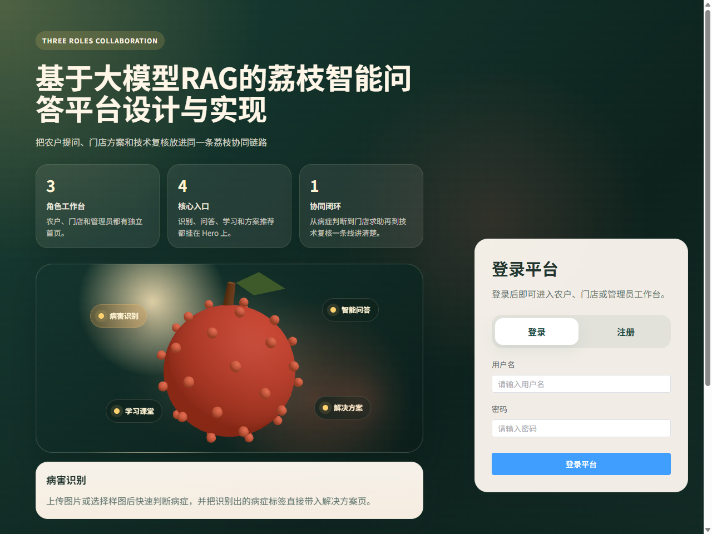
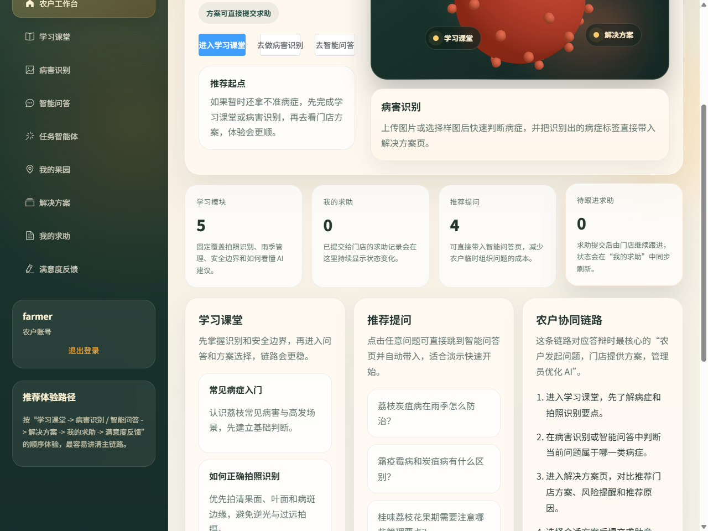
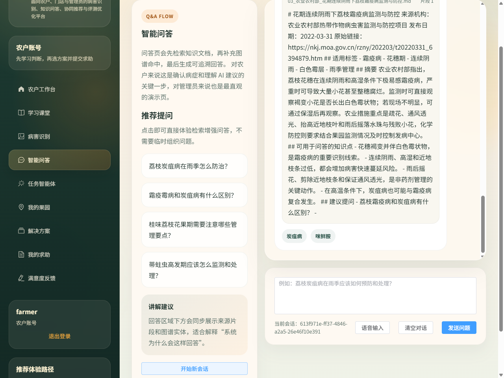
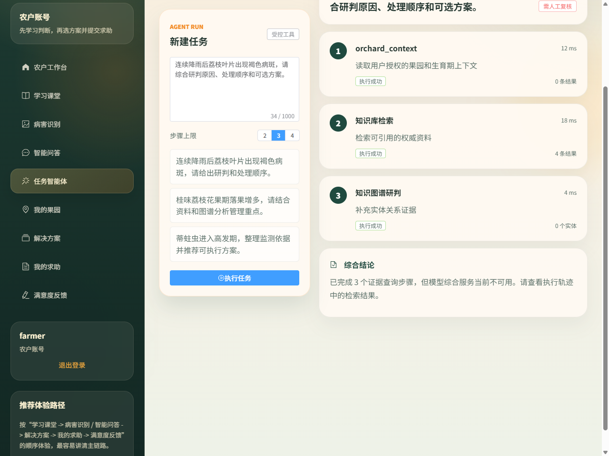
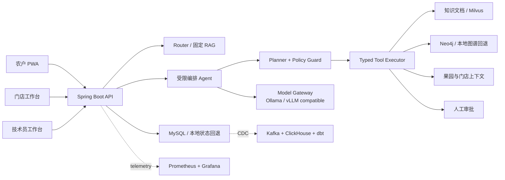

# Litchi Copilot - 荔枝智能农技协同平台

[](https://github.com/hxt0227cu-alt/litchi-agri-rag-platform/actions/workflows/ci.yml)


面向农技服务公司、合作社和连锁农资机构的 B2B2C 协同平台。项目将农户诊断、AI 证据检索、技术员审核、门店履约和效果反馈串成业务闭环，而不是只提供一个聊天机器人。

> 项目状态：核心业务和受限 Agent 可本地运行；数据平台、可观测和 Helm 为可部署模板。仓库只把实际执行过的结果标记为“已验证”，完整 GPU 推理、CDC 和 Kubernetes 高可用仍列为待验证项。

## 演示界面

平台提供农户、门店、技术员三类角色工作台，下方为本地运行时的实际界面截图。

| 平台登录与功能定位 | 农户工作台（业务全景） |
| --- | --- |
|  |  |

| RAG 智能问答（带可追溯证据） | 受限 Agent 任务执行（工具编排与降级） |
| --- | --- |
|  |  |

## 可验证结果

以下结果于 2026-09-04 在 Windows 11、i5-1240P、15.7 GB 内存环境执行，原始报告和复现命令见 [EVIDENCE.md](EVIDENCE.md)。

| 验证项 | 实际结果 | 范围 |
| --- | ---: | --- |
| 后端自动化测试 | 51/51 通过 | Agent、安全护栏、检索、权限、接口、协同、幂等与反馈 |
| 固定评测任务集 | 60/60 通过 | 30 RAG + 20 Agent + 10 安全任务 |
| RAG 混合检索召回 | 30/30 | BM25 + 哈希向量 + Rerank（hybrid 策略） |
| 安全护栏（Policy Guard） | 10/10 拒绝 | 提示注入、越权写、数据外泄、编造、危险工具、跨租户 |
| Agent k6 负载 | P95=508ms，成功率 100% | 2-5 req/s 固定到达率，阈值 P95<12s |
| 前端权限测试 | 通过 | TypeScript 权限规则 |
| 前端生产构建 | 1,729 modules，24.96s | Vue/TypeScript/Vite |
| 降级模式聊天基线 | 20 次，平均 159.88ms | 外部 AI 依赖不可用，本地证据回退 |
| 降级模式诊断基线 | 20 次，平均 47.43ms | 规则回退，不代表 YOLO 推理性能 |
| 100 并发聊天测试 | **100% 成功（200/200），P95=69.7ms，max=75ms** | 修复前 19%（2026-07-31）/ 0%（本轮修复前），原始失败数据保留于 `reports/validation/20260731-162446/` |
| 检索基线（本地哈希，离线复算） | Recall@5=90%（27/30），MRR@5=0.85 | 精确复刻 SimpleEmbeddingService 算法 |
| 真实模型检索（BGE-M3+reranker） | **Recall@5=100%（30/30）**，MRR@5=0.778，avg 739ms | SiliconFlow 免费 API 实测，3 个漏检用例全部找回；MRR 略降（排序待调优） |
| Agent 持久化 | 主表+步骤表+审批表拆分，跨实例恢复（陈旧运行→interrupted，等待审批保留） | 详见 [EVIDENCE](EVIDENCE.md) |
| 写工具幂等 | 通过（同幂等键重复提交只落一条，单元测试覆盖重复审批/重复恢复） | `SaveRemedyPlanRequest.idempotencyKey` + `createPlan` 查重 |

## 业务闭环

1. 农户维护果园上下文，通过图片、症状和文本发起诊断。
2. 系统组合本地知识文档、知识图谱、果园档案和门店方案证据。
3. Agent 返回执行步骤、引用证据、风险级别、降级状态和审核要求。
4. 写操作只生成待审批动作，技术员确认后才能保存方案。
5. 农户创建求助，门店处理并记录状态，反馈进入评测与运营链路。

## 技术难点

### 1. 受限 Agent 治理：不让模型“为所欲为”

农业诊疗涉及用药与业务协同，直接放开模型做工具调用（开放式 ReAct）在提示注入、越权写入和结果不可控上不可接受。项目采用 **Planner + 权限过滤 + 顺序执行 + 结果综合** 四阶段受限架构：模型只负责从服务端白名单中选择工具，不能生成并执行代码、URL 或数据库语句；计划最多 4 步；未知、重复和越权工具在执行前被 Policy Guard 丢弃。安全护栏按提示注入、越权写、数据外泄、编造、危险工具、跨租户六类意图拦截，并以 `refused` 终态落账。固定安全评测集 10/10 拒绝。

### 2. 写工具人工审批与幂等去重

`pending_remedy_plan` 是唯一的写工具：审批前只返回动作预览，技术员在 `waiting_approval` 状态确认后才落库；审批拒绝不执行写入。为避免重复审批 / 重复恢复造成重复落库，写工具以 **Agent 运行 ID 作为幂等键**：`createPlan` 先查重，同一键重复提交直接返回既有方案，不产生重复记录；审批决策本身带 `decided_by` / `decided_at` 审计。幂等行为有专门单元测试覆盖。

### 3. Agent 持久化三表拆分与跨实例恢复

运行记录从单表演进为 **主表（`platform_agent_runs` 结构化列）+ 步骤表（`platform_agent_steps` 每步一行）+ 审批表（`platform_agent_approvals`）**，规避 payload_json 全量重写的热路径开销。后台 60 秒恢复扫描将超过 120 秒未推进的 `created/planning/running` 运行标记为 `interrupted`；因写工具不保证幂等，**不自动续跑**（避免已执行写步骤的重复副作用），而等待审批的运行跨实例保留、可继续审批决策。MySQL 不可用时降级到最多 500 条内存存储，重连后按内存快照回填补齐缺口。

### 4. 混合检索与真实模型评测

检索策略可切换（`app.retrieval.strategy`：`hybrid/bm25/vector/lexical`），融合 BM25、哈希向量与 Rerank。用 SiliconFlow 免费 API 对真实模型（BGE-M3 + bge-reranker-v2-m3）做 30 条固定 RAG 任务评测：Recall@5 从哈希基线的 90%（27/30）提升到 **100%（30/30）**——原先 3 个“绿色防控监测频次”类漏检用例全部找回；MRR@5 0.85→0.778 暴露了 reranker 排序待调优的边界，如实记录而非掩盖。

### 5. 高并发与启动链路调优

100 并发聊天从全超时修复到 **100% 成功（200/200）、P95 69.7ms**，根因有两处：`EvaluationService.getActiveFeedbackRules()` 的 TTL 过期瞬间并发全量重算惊群（改为后台预热线程 + 双重检查锁）；Neo4j 首个请求真实连接可挂起约 2.7 分钟并串行阻塞整批并发（改为启动预探测 + 连接超时 3s）。

### 6. 多级降级与可观测

MySQL / Neo4j / Milvus / Ollama 任一不可用时不至于白屏：各链路显式返回 `degraded` 状态并给出本地证据回退；SSE 推送 Agent 状态变化；Prometheus 记录运行、工具、耗时和风险指标；聊天历史在 MySQL 重连后全量对账补齐。

## 架构



### Agent 治理

- 单编排 Agent 加白名单领域工具，不开放 Shell、SQL、任意 URL 或动态代码。
- 运行状态覆盖 `created`、`running`、`waiting_approval`、`completed`、`failed` 和 `canceled`。
- 计划最多 4 步；未知、重复和越权工具在执行前被 Guard 丢弃。
- `pending_remedy_plan` 是当前写工具，必须由技术员确认。
- 运行记录优先写 MySQL，不可用时回退至最多 500 条的内存存储。
- SSE 推送状态变化；Prometheus 记录运行、工具、耗时和风险指标。

架构取舍见 [AI Agent 设计](docs/AI-Agent架构设计.md) 和 [ADR](202607worklog/01-adr/)。

## 仓库结构

```text
backend/             Spring Boot API、Agent、权限与业务服务
frontend/            Vue 3 农户/门店/技术员工作台
diagnosis-service/   Python 图像诊断服务与降级逻辑
benchmarks/          Agent 评测器与负载脚本
datasets/evaluation/ 固定评测任务集
data-platform/       Kafka、ClickHouse、Airflow、dbt 骨架
observability/       Prometheus 与 Grafana 配置
deploy/helm/         Kubernetes Helm Chart
reports/validation/  可追溯 Markdown 与原始 JSON
202607worklog/       ADR、开发、测试和事故记录
```

## 快速开始

### 轻量开发模式

轻量模式允许 MySQL、Neo4j、Milvus、Ollama 和诊断服务不可用，并明确返回 `degraded` 状态。

```powershell
cd backend
mvn spring-boot:run
```

```powershell
cd frontend
npm ci
npm run dev
```

访问 `http://localhost:5173`。演示账号为 `farmer`、`shopkeeper`、`technician`，本地演示密码均为 `demo123`。

### 完整 Compose

```powershell
Copy-Item .env.example .env
docker compose up -d --build
```

示例密码仅适用于本机演示，任何公开部署必须通过 Secret 覆盖。

## 关键接口

| 能力 | 接口 |
| --- | --- |
| 创建 Agent 运行 | `POST /api/v1/agent-runs` |
| 列出 Agent 运行（重启/跨实例可见性） | `GET /api/v1/agent-runs?limit=&status=` |
| 查询 Agent 运行 | `GET /api/v1/agent-runs/{runId}` |
| SSE 进度 | `GET /api/v1/agent-runs/{runId}/events` |
| 审批写动作 | `POST /api/v1/agent-runs/{runId}/confirm` |
| 取消运行 | `POST /api/v1/agent-runs/{runId}/cancel` |
| 问答 | `POST /api/chats` |
| 图像诊断 | `POST /api/diagnoses` |
| 果园档案 | `GET/POST /api/orchards` |
| 门店求助 | `POST /api/consultations` |

完整说明见 [API 文档](docs/API接口文档.md)。

## 复现验证

```powershell
cd backend
mvn -B test

cd ../frontend
npm test
npm run build

cd ..
python scripts/build-agent-eval-dataset.py
python benchmarks/evaluate_agent.py --validate-only
```

性能脚本、环境信息、原始报告和未达标项见 [证据索引](EVIDENCE.md) 与 [已知限制](KNOWN_LIMITATIONS.md)。

## 安全与边界

本项目提供农技辅助信息，不代替现场技术员判断。涉及精确用药、高风险病害或证据不足时应转人工审核。漏洞报告方式见 [SECURITY.md](SECURITY.md)。

## License

Licensed under the [Apache License 2.0](LICENSE).
