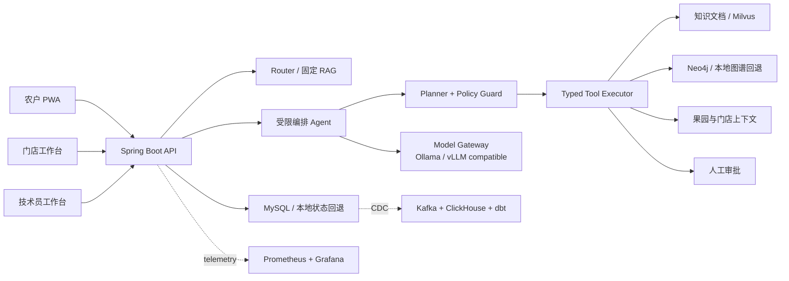

# Litchi Copilot - 荔枝智能农技协同平台

[](https://github.com/hxt0227cu-alt/RAG-graduation/actions/workflows/ci.yml)


面向农技服务公司、合作社和连锁农资机构的 B2B2C 协同平台。项目将农户诊断、AI 证据检索、技术员审核、门店履约和效果反馈串成业务闭环，而不是只提供一个聊天机器人。

> 项目状态：核心业务和受限 Agent 可本地运行；数据平台、可观测和 Helm 为可部署模板。仓库只把实际执行过的结果标记为“已验证”，完整 GPU 推理、CDC 和 Kubernetes 高可用仍列为待验证项。

## 可验证结果

以下结果于 2026-07-31 在 Windows 11、i5-1240P、15.7 GB 内存环境执行，原始报告和复现命令见 [EVIDENCE.md](EVIDENCE.md)。

| 验证项 | 实际结果 | 范围 |
| --- | ---: | --- |
| 后端自动化测试 | 38/38 通过 | Agent、权限、接口、协同与反馈 |
| 前端权限测试 | 通过 | TypeScript 权限规则 |
| 前端生产构建 | 1,729 modules，24.96s | Vue/TypeScript/Vite |
| 固定评测任务集 | 60 条，结构校验通过 | 30 RAG + 20 Agent + 10 安全任务 |
| 降级模式聊天基线 | 20 次，平均 159.88ms | 外部 AI 依赖不可用，本地证据回退 |
| 降级模式诊断基线 | 20 次，平均 47.43ms | 规则回退，不代表 YOLO 推理性能 |
| 100 并发聊天测试 | 未通过，成功率 19% | 已保留失败原始数据，禁止包装为达标 |

## 业务闭环

1. 农户维护果园上下文，通过图片、症状和文本发起诊断。
2. 系统组合本地知识文档、知识图谱、果园档案和门店方案证据。
3. Agent 返回执行步骤、引用证据、风险级别、降级状态和审核要求。
4. 写操作只生成待审批动作，技术员确认后才能保存方案。
5. 农户创建求助，门店处理并记录状态，反馈进入评测与运营链路。

## 架构



### Agent 治理

- 单编排 Agent 加白名单领域工具，不开放 Shell、SQL、任意 URL 或动态代码。
- 运行状态覆盖 `created`、`running`、`waiting_approval`、`completed`、`failed` 和 `canceled`。
- 计划最多 4 步；未知、重复和越权工具在执行前被 Guard 丢弃。
- `pending_remedy_plan` 是当前写工具，必须由技术员确认。
- 运行记录优先写 MySQL，不可用时回退至最多 500 条的内存存储。
- SSE 推送状态变化；Prometheus 记录运行、工具、耗时和风险指标。

架构取舍见 [AI Agent 设计](docs/AI-Agent架构设计.md) 和 [ADR](202607worklog/01-adr/)。

## 仓库结构

```text
backend/             Spring Boot API、Agent、权限与业务服务
frontend/            Vue 3 农户/门店/技术员工作台
diagnosis-service/   Python 图像诊断服务与降级逻辑
benchmarks/          Agent 评测器与负载脚本
datasets/evaluation/ 固定评测任务集
data-platform/       Kafka、ClickHouse、Airflow、dbt 骨架
observability/       Prometheus 与 Grafana 配置
deploy/helm/         Kubernetes Helm Chart
reports/validation/  可追溯 Markdown 与原始 JSON
202607worklog/       ADR、开发、测试和事故记录
```

## 快速开始

### 轻量开发模式

轻量模式允许 MySQL、Neo4j、Milvus、Ollama 和诊断服务不可用，并明确返回 `degraded` 状态。

```powershell
cd backend
mvn spring-boot:run
```

```powershell
cd frontend
npm ci
npm run dev
```

访问 `http://localhost:5173`。演示账号为 `farmer`、`shopkeeper`、`technician`，本地演示密码均为 `demo123`。

### 完整 Compose

```powershell
Copy-Item .env.example .env
docker compose up -d --build
```

示例密码仅适用于本机演示，任何公开部署必须通过 Secret 覆盖。

## 关键接口

| 能力 | 接口 |
| --- | --- |
| 创建 Agent 运行 | `POST /api/v1/agent-runs` |
| 查询 Agent 运行 | `GET /api/v1/agent-runs/{runId}` |
| SSE 进度 | `GET /api/v1/agent-runs/{runId}/events` |
| 审批写动作 | `POST /api/v1/agent-runs/{runId}/confirm` |
| 取消运行 | `POST /api/v1/agent-runs/{runId}/cancel` |
| 问答 | `POST /api/chats` |
| 图像诊断 | `POST /api/diagnoses` |
| 果园档案 | `GET/POST /api/orchards` |
| 门店求助 | `POST /api/consultations` |

完整说明见 [API 文档](docs/API接口文档.md)。

## 复现验证

```powershell
cd backend
mvn -B test

cd ../frontend
npm test
npm run build

cd ..
python scripts/build-agent-eval-dataset.py
python benchmarks/evaluate_agent.py --validate-only
```

性能脚本、环境信息、原始报告和未达标项见 [证据索引](EVIDENCE.md) 与 [已知限制](KNOWN_LIMITATIONS.md)。

## 安全与边界

本项目提供农技辅助信息，不代替现场技术员判断。涉及精确用药、高风险病害或证据不足时应转人工审核。漏洞报告方式见 [SECURITY.md](SECURITY.md)。

## License

Licensed under the [Apache License 2.0](LICENSE).
